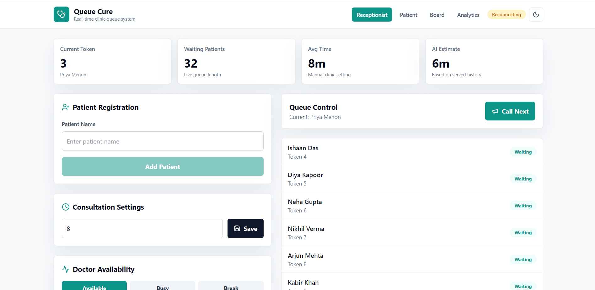
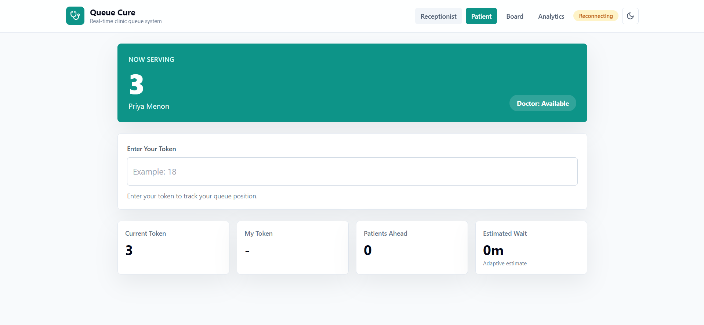
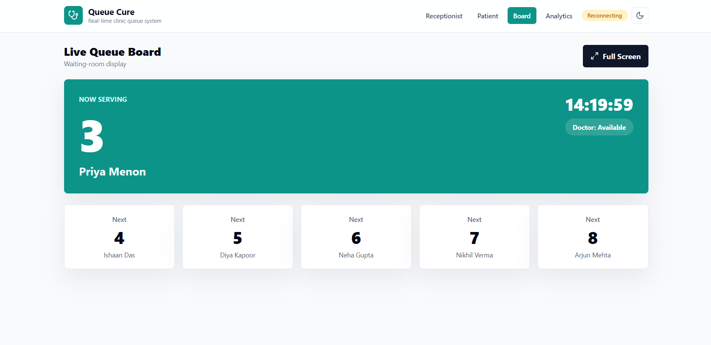
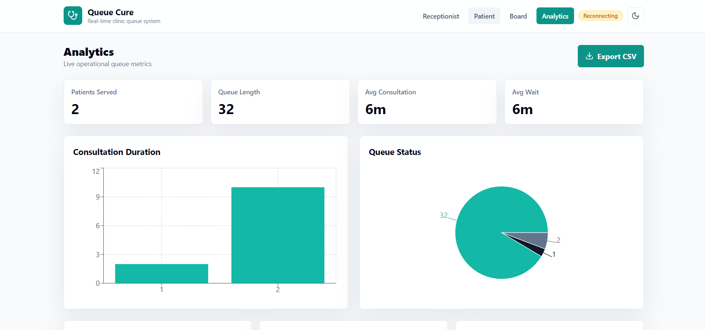

# QueueCure AI

Real-Time Smart Clinic Queue Management System

QueueCure AI transforms traditional paper-token systems into a transparent, real-time digital queue experience for clinics and hospitals.

---

## Problem

Patients often wait without knowing:

- When they will be called
- How many patients are ahead
- Estimated waiting time

This uncertainty creates frustration for patients and increases workload for reception staff.

---

## Solution

QueueCure AI provides:

- Real-Time Queue Tracking
- Live Token Updates
- Adaptive Wait-Time Prediction
- Doctor Availability Status
- Voice Announcements
- Analytics Dashboard
- CSV Report Generation

All updates are synchronized instantly using Socket.IO.

---

## Features

### Receptionist Dashboard

- Add Patient
- Generate Token
- Call Next Patient
- Manage Consultation Time
- Monitor Queue Status

### Patient Dashboard

- Current Token
- Personal Token Tracking
- Patients Ahead
- Estimated Wait Time

### Live Queue Board

- Waiting Room Display
- Current Token
- Upcoming Patients
- Doctor Status

### Analytics

- Patients Served
- Queue Statistics
- Consultation Insights

---

## Tech Stack

### Frontend

- React.js
- Tailwind CSS
- Axios
- Socket.IO Client

### Backend

- Node.js
- Express.js
- Socket.IO

### Database

- MongoDB Atlas
- Mongoose

### Deployment

- Vercel
- Render

---

## Architecture

Reception Dashboard
↓
Node.js + Express
↓
Socket.IO
↓
MongoDB
↓
Patient Dashboard

---

## Screenshots

### Receptionist Dashboard



### Patient Dashboard



### Live Queue Board



### Analytics Dashboard



### Clone Repository

```bash
git clone https://github.com/jeffrinsamuel2006/QueueCure/tree/main
